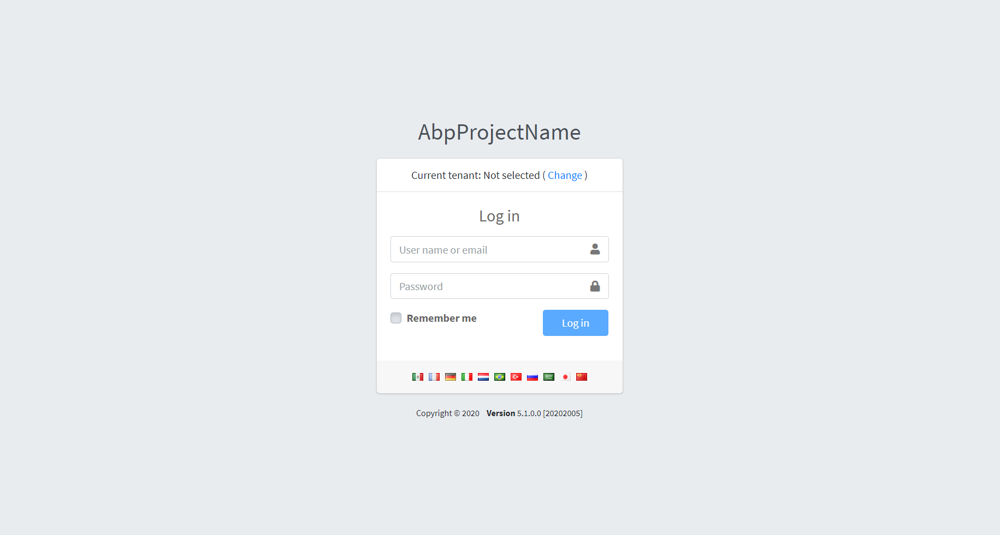

# Employees System
A dashboard for managing departments and their employees using ASP.NET Boilerplate.

# Screenshots
#### Login Page


#### Departments Page


#### Employees Page


# How to run?
## Front-end
### Prerequisites
- Nodejs
- NPM
- Angular CLI

### Instructions
1. Enter the `\angular` directory/folder
2. Install node_modules:
```
npm install
```
3. Start the application locally:
```
npm run start
```

## Backend
### Prerequisites
- .NET 7.0 Runtime
- .NET 7.0 SDK
- Visual Studio (optional)
- Docker (optional)

### Instructions (Visual Studio)
1. Enter the `\aspnet-core` directory/folder
2. Open `EmployeesSystem.sln` using Visual Studio
3. Run EmployeesSystem.Web.Host
4. `https://localhost:44311/` will be opened in the browser with the swagger page.


### Instructions (Command line)
1. Enter the `\aspnet-core\src\EmployeesSystem.Web.Host\` directory/folder
2. In the terminal, run:
```
dotnet run
```
3. Open `https://localhost:44311/` in the browser to access the swagger page.

### Instructions (Docker)
1. Enter the `\aspnet-core\src\EmployeesSystem.Web.Host\` directory/folder
2. Build the docker image:
```
docker build -t employee-system .
```
3. Run the container:
```
docker run -d -p 8080:80 employee-system
```

# How to use?
1. Open `https://localhost:4200/` to access the UI
2. Login with:
  - Username: admin
  - Password: 123qwe
